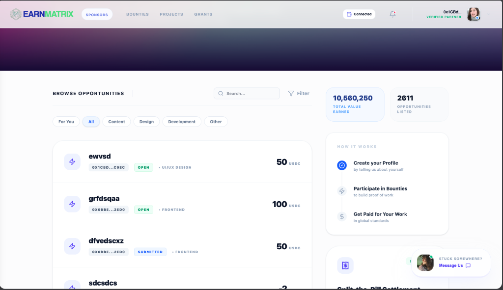
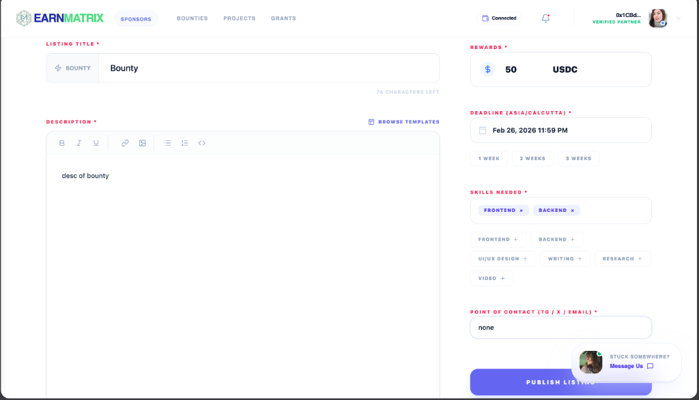
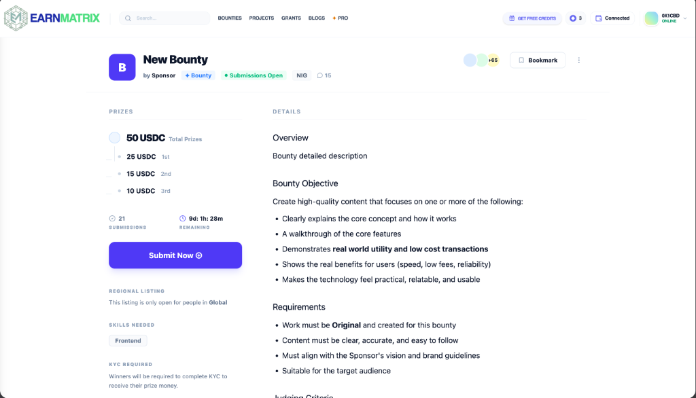
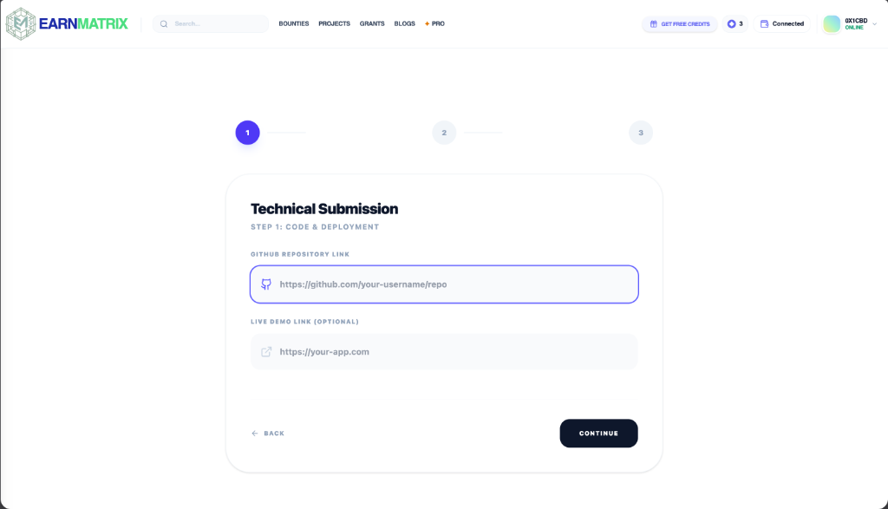
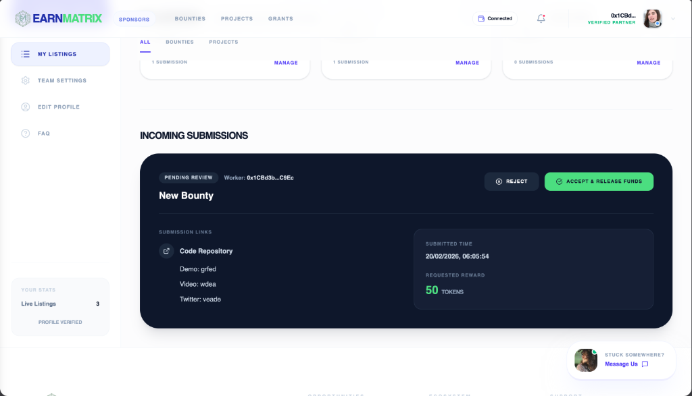

<div align="center">
  
  <br/>
  
  <h1 align="center">EarnMatrix - Micro-Task Bounty Board</h1>
  <p align="center">
    <strong>The Decentralized Operating System for Modern Campus Talent, Powered Entirely by Algorand.</strong>
  </p>

  <p align="center">
    <a href="#about-the-project">About</a> •
    <a href="#live-demo--video">Live Demo</a> •
    <a href="#architecture-overview">Architecture Overview</a> •
    <a href="#tech-stack">Tech Stack</a> •
    <a href="#usage-guide-with-screenshots">Usage Guide</a> •
    <a href="#known-limitations">Known Limitations</a> •
    <a href="#team-members-and-roles">Team</a>
  </p>
</div>

---

## 📽️ Live Demo & Video
- **Live Demo URL:** [https://earn-matrix.vercel.app/](https://earn-matrix.vercel.app/)
- **LinkedIn Demo Video:** [Watch on LinkedIn](https://www.linkedin.com/posts/iamksr05_earnmatrix-blockchain-algorand-ugcPost-7430423636378890240-3pD-?utm_source=share&utm_medium=member_desktop&rcm=ACoAAE1IzEkBwMES46UdCriH_ugG4yqjAM1IdkI)
- **App ID (Testnet):** 643020148
  - **Explorer Link (Allo):** [View on Allo Testnet Explorer](https://allo.info/testnet/application/643020148)
  - **Explorer Link (Pera):** [View on Pera Testnet Explorer](https://testnet.explorer.perawallet.app/application/643020148/)

---

## ⚡ About The Project
Workers often worry about getting paid, and buyers worry about whether the work will actually be delivered. Most platforms try to solve this with policies and moderation — we wanted to solve it with technology.

That’s why we built EarnMatrix.

When a task (bounty) is listed, the payment is locked directly into an Algorand smart contract. This ensures the money already exists and is reserved for the worker before any work begins.

Once the work is completed, the submission is shared through a secure, view-only sandbox so the buyer can verify quality without being able to copy or misuse the project.

And the best part — the moment the buyer accepts the work, the payment is automatically released from the smart contract to the worker. No delays, no disputes, no dependency on trust.

Over time, every completed bounty becomes part of an on-chain resume, giving students a verifiable proof-of-work portfolio instead of just claims on a CV. We also added practical features like bill splitting through instant ALGO/USDC micro-transactions and consent-based privacy controls, so users decide how their data is shared.

EarnMatrix was built with a simple idea: fairness should be enforced by code, not promises.

---

## 🏗 Architecture Overview — Smart Contract + Frontend Interaction

EarnMatrix leverages a hybrid Web2/Web3 architecture to ensure lightning-fast UI rendering while maintaining strict cryptographic security for settlements:

1. **Authentication:** Users authenticate via Web3 Wallets (Privy, Pera, Defly) which maps their Algorand Wallet Address to their Session UI.
2. **The Post & Escrow:** A Sponsor creates a "Bounty", locking the reward into the Algorand Smart Contract (`EarnMatrixEscrow`). The backend database records the metadata (title, description), while the actual funds are natively bound to the smart contract.
3. **The Claim & Work:** Students browse the bounty board. All metadata is fetched instantly via our backend, while the "Funded Status" and active escrows are verified by querying the Algorand Node.
4. **The Settlement:** The Sponsor reviews the submission. Upon approval, the Smart Contract function `releaseEscrow` is triggered. The funds are instantaneously transferred from the mathematical lockbox directly into the student's Algorand wallet via L1 consensus.
5. **The Ledger:** The database marks the task as `paid`, and the blockchain immortalizes the transaction, serving as a verifiable resume credential.

---

## � Tech Stack
* **Core SDK & Tools:** Auto-deployment and interaction are managed via **AlgoKit**.
* **Smart Contract Language:** Smart contracts are written via **PyTEAL / Beaker / TEALScript** representing the secure on-chain escrow, bill-splitting, and task logging mechanisms.
* **Frontend:** Modern SPA built with **React.js + Vite**, **Tailwind CSS**, and **Framer Motion**, integrated with **Privy** for frictionless wallet-based auth natively connecting to the Algorand Testnet.

---

## ⚙️ Installation & Setup Instructions

### Prerequisites
- Node.js installed (v18+)
- An Algorand Web3 Wallet (via Privy, Pera Wallet, or Defly)
- AlgoKit installed for Smart Contract deployment

### 1. Clone the repository
```bash
git clone https://github.com/iamksr05/earn-matrix.git
cd chain-matrix
```

### 2. Frontend Setup
```bash
cd nirmanlabs-1
npm install
```

Create a `.env` file in the `nirmanlabs-1` folder:
```env
# Network and RPC
VITE_RPC_URL=https://testnet-api.algonode.cloud
VITE_CHAIN_ID=416002 

# Smart Contracts
VITE_ESCROW_ADDRESS=643020148

# Services
VITE_PRIVY_APP_ID=YOUR_PRIVY_ID
VITE_SUPABASE_URL=YOUR_SUPABASE_URL
VITE_SUPABASE_ANON_KEY=YOUR_SUPABASE_ANON_KEY
```

Run the development server:
```bash
npm run dev
```

### 3. Smart Contract Deployment (Optional)
If deploying your own instance:
```bash
cd ../smart-contracts
npm install
# Assuming integration with AlgoKit/Teal flow
npx hardhat run scripts/deploy.js --network testnet
```

---

## � Usage Guide with Screenshots

1. **Student Dashboard:** View available campus bounties, track your active gigs, and monitor total ALGO earned.
<div align="center"></div><br/>

2. **Create Bounty Sponsor Panel:** Sponsors enter task requirements and securely lock funds into the Algorand smart contract via their connected wallet.
<div align="center"></div><br/>

3. **Bounty Details Page:** Both parties can view the exact status of the task. Students can claim it and begin working.
<div align="center"></div><br/>

4. **Student Submission Portal:** Students submit proof of work (GitHub repos, docs) securely.
<div align="center"></div><br/>

5. **Sponsor Review Panel:** Sponsors review the provided work. Approving the work instantly fires the `releaseEscrow` call to send funds to the student.
<div align="center"></div><br/>

---

## ⚠️ Known Limitations
- The "secure, view-only sandbox" is currently limited to certain file types or relies on specific integrations (e.g., standard GitHub links or PDFs) and may not fully prevent screenshots or manual copying of text depending on the browser environment.
- Asset opt-in requires manual transaction approval from students before receiving USDC or other ASAs natively on Algorand.
- Testnet nodes might occasionally rate-limit requests during high-frequency API consumption in development.

---

## � Team Members and Roles
- **Omkar Shewale:** Frontend Developer
- **Karan Ram:** Backend Developer
- **Nikhil Kumar:** Ideation and Frontend Dev
- **Aayush kumar Mishra:** Ideation and Presentation

---

<p align="center">
  <br>
  <i>"Building the future of verifiable student work, secured mathematically by Algorand."</i>
</p>
